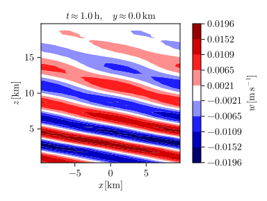

# PinCFlow.jl: An idealized-atmospheric-flow solver coupled to the 3D transient gravity-wave model MS-GWaM

[](https://Atmospheric-Dynamics-GUF.github.io/PinCFlow.jl/stable)
[](https://Atmospheric-Dynamics-GUF.github.io/PinCFlow.jl/dev)
[](https://github.com/Atmospheric-Dynamics-GUF/PinCFlow.jl/actions?query=workflow%3ACI)
[](https://codecov.io/gh/Atmospheric-Dynamics-GUF/PinCFlow.jl)
[](https://coveralls.io/github/Atmospheric-Dynamics-GUF/PinCFlow.jl?branch=main)
[](https://opensource.org/licenses/MIT)
[](https://doi.org/10.5281/zenodo.17391579)

## Introduction

PinCFlow.jl is an atmospheric-flow solver that was designed for conducting idealized simulations. It integrates the Boussinesq, pseudo-incompressible and compressible equations in a conservative flux form ([Klein, 2009](https://doi.org/10.1007/s00162-009-0104-y); [Rieper et al., 2013](https://doi.org/10.1175/mwr-d-12-00026.1)), using a semi-implicit method that combines explicit and implicit time-stepping schemes ([Benacchio & Klein, 2019](https://doi.org/10.1175/MWR-D-19-0073.1); [Schmid et al., 2021](https://doi.org/10.1175/MWR-D-21-0126.1); [Chew et al., 2022](https://doi.org/10.1175/MWR-D-21-0175.1)). Spatially, the equations are discretized with a finite-volume method, such that all quantities are represented by averages over grid cells and fluxes are computed on the respective cell interfaces. The grid is staggered so that the velocity components are defined at the same points as the corresponding fluxes of scalar quantities. PinCFlow.jl operates in a vertically stretched terrain-following coordinate system based on [Gal-Chen and Somerville (1975a)](https://doi.org/10.1016/0021-9991(75)90037-6), [Gal-Chen and Somerville (1975b)](https://doi.org/10.1016/0021-9991(75)90054-6) and [Clark (1977)](https://doi.org/10.1016/0021-9991(77)90057-2).

The Lagrangian WKB model MS-GWaM is interactively coupled to the dynamical core of PinCFlow.jl, so that unresolved gravity waves may be parameterized in a manner that accounts for transient wave-mean-flow interaction and horizontal wave propagation. The resolved fields are updated with tendencies computed by MS-GWaM at the beginning of every time step. A description of the theory behind MS-GWaM can be found in [Achatz et al. (2017)](https://doi.org/10.1002/qj.2926) and [Achatz et al. (2023)](https://doi.org/10.1063/5.0165180). For a numerical perspective and more information on the development, see [Muraschko et al. (2014)](https://doi.org/10.1002/qj.2381), [Boeloeni et al. (2016)](https://doi.org/10.1175/JAS-D-16-0069.1), [Wilhelm et al. (2018)](https://doi.org/10.1175/JAS-D-17-0289.1), [Wei et al. (2019)](https://doi.org/10.1175/JAS-D-18-0337.1) and [Jochum et al. (2025)](https://doi.org/10.1175/JAS-D-24-0158.1).

## User guide

### Installation

To install PinCFlow.jl, first make sure you have installed [Julia](https://docs.julialang.org/en/v1/manual/installation/). You can then run

```shell
julia --project -e 'using Pkg; Pkg.add("PinCFlow")'
```

to add PinCFlow.jl to your current project environment.

### Running the model

As a minimal example, the script

```julia
using PinCFlow

integrate(Namelists())
```

runs PinCFlow.jl in its default configuration, if executed with

```shell
julia --project script.jl
```

in your project's directory. This simulation will finish comparatively quickly and won't produce particularly interesting results, since PinCFlow.jl simply initializes a $1 \times 1 \times 1 \, \mathrm{km^3}$ isothermal atmosphere at rest with $3 \times 3 \times 3$ grid points and integrates the pseudo-incompressible equations over one hour. A more complex configuration can be set up by providing namelists with changed parameters. This is illustrated in PinCFlow.jl's example scripts. To run them, we recommend setting up an examples project by executing

```shell
julia --project=examples -e 'using Pkg; Pkg.add(["CairoMakie", "HDF5", "HDF5_jll", "MPICH_jll", "MPIPreferences", "PinCFlow", "Revise"])'
```

Having done this, you can easily run any of the example scripts without needing to worry about extra packages that you may need. For instance, running the script

```julia
# examples/submit/periodic_hill.jl

using Pkg

Pkg.activate("examples")

using Revise
using PinCFlow

npx = length(ARGS) >= 1 ? parse(Int, ARGS[1]) : 1
npz = length(ARGS) >= 2 ? parse(Int, ARGS[2]) : 1

h0 = 10.0
l0 = 10000.0

lz = 20000.0
zr = 10000.0

atmosphere = AtmosphereNamelist(;
    coriolis_frequency = 0.0,
    initial_u = (x, y, z) -> 10.0,
)
domain = DomainNamelist(;
    x_size = 40,
    y_size = 1,
    z_size = 40,
    lx = 20000.0,
    ly = 20000.0,
    lz,
    npx,
    npz,
)
grid = GridNamelist(;
    resolved_topography = (x, y) -> h0 / 2 * (1 + cos(pi / l0 * x)),
)
output =
    OutputNamelist(; output_variables = (:w,), output_file = "periodic_hill.h5")
sponge = SpongeNamelist(;
    rhs_sponge = (x, y, z, t, dt) ->
        z >= zr ? sin(pi / 2 * (z - zr) / (lz - zr))^2 / dt : 0.0,
)

integrate(Namelists(; atmosphere, domain, grid, output, sponge))

```

yields a 2D simulation with an initial wind of $10 \, \mathrm{m \, s^{- 1}}$ that generates a mountain wave above a periodic hill. The vertical wind is written to the output file `periodic_hill.h5`. You can find the other examples in the "Examples" section of the documentation. A description of all namelists and their parameters is provided in the "Reference" section.

If you want to run PinCFlow.jl in parallel, make sure you are using the correct backends for [MPI.jl](https://juliaparallel.org/MPI.jl/latest/) and [HDF5.jl](https://juliaio.github.io/HDF5.jl/stable/). By default, the two packages use JLL backends that have been automatically installed. If you want to keep this setting, you only need to make sure to use the correct MPI binary (specifically not that of a default MPI installation on your system). For example, with

```shell
mpiexec=$(julia --project=examples -e 'using MPICH_jll; println(MPICH_jll.mpiexec_path)')
${mpiexec} -n 16 julia examples/submit/periodic_hill.jl 4 4
```

you can run the above simulation in 16 MPI processes. Note that by passing extra arguments to the script, you set the parameters `npx` and `npz` of the namelist `domain`, which represent the number of MPI processes in $\widehat{x}$ and $\widehat{z}$. Their product must be equal to the total number of processes, otherwise PinCFlow.jl will throw an error.

However, if you plan to run PinCFlow.jl on a cluster, you may want to consider using a provided MPI installation as backend. In that case, the MPI preferences need to be updated accordingly and the HDF5 backend has to be set to a library that has been installed with parallel support, using the chosen MPI installation. This can be done by running

```shell
julia --project=examples -e 'using MPIPreferences; MPIPreferences.use_system_binary(; library_names = ["/path/to/mpi/library/"])'
julia --project=examples -e 'using HDF5; HDF5.API.set_libraries!("/path/to/libhdf5.so", "/path/to/libhdf5_hl.so")'
```

with the paths set appropriately (more details can be found in the documentations of MPI.jl and HDF5.jl). Note that this configuration will be saved in `examples/LocalPreferences.toml`, so that the new backends will be used by all future scripts run in the examples project. By running

```shell
julia --project=examples -e 'using MPIPreferences; MPIPreferences.use_jll_binary()'
julia --project=examples -e 'using HDF5; HDF5.API.set_libraries!()'
```

you can restore the default backends. Having configured MPI.jl and HDF5.jl to use installations on your system, you can run

```shell
mpiexec -n 16 julia examples/submit/periodic_hill.jl 4 4
```

with `mpiexec` being your chosen system binary. For users who would like to run PinCFlow.jl on [Goethe](https://csc.uni-frankfurt.de/wiki/doku.php?id=public:usage:goethe) or [Levante](https://docs.dkrz.de/doc/levante/index.html), shell-script examples are provided in the folder `examples/submit` of the repository.

### Visualizing the results

PinCFlow.jl uses parallel HDF5 to write simulation data. By default, the path to the output file is `pincflow_output.h5`. This may be changed by setting the parameter `output_file` of the namelist `output` accordingly (as illustrated above). The dimensions of most output fields are (in order) $\widehat{x}$ (zonal axis), $\widehat{y}$ (meridional axis), $\widehat{z}$ (axis orthogonal to the vertical coordinate surfaces) and $t$ (time). Ray-volume-property fields differ slightly in that they have an additional (spectral) dimension in front and a vertical dimension that includes the first ghost layer below the surface. To specify which fields are to be written, set the parameters `output_variables`, `save_ray_volumes` and `prepare_restart` of the namelist `output` accordingly (more details are given in the "Reference" section of the documentation).

For the visualization of simulation results, we recommend using [Makie.jl](https://docs.makie.org/stable/) with the `CairoMakie` backend. PinCFlow.jl has an extension which exports a few convenience functions if `CairoMakie` is loaded. The script

```julia
# examples/visualization/periodic_hill.jl

using Pkg

Pkg.activate("examples")

using HDF5
using CairoMakie
using Revise
using PinCFlow

h5open("periodic_hill.h5") do data
    plot_contours(
        "examples/results/periodic_hill.svg",
        data,
        "w",
        (1, 1, 1, 2);
        label = L"w\,[\mathrm{m\,s^{-1}}]",
    )
    return
end

```

is an example for how to visualize the vertical wind at the end of the above simulation, using PinCFlow.jl's `plot_contours`. The resulting plot is displayed below.



## List of publications

 1. Initial flow solver: [Rieper et al. (2013)](https://doi.org/10.1175/mwr-d-12-00026.1)

 1. Initial gravity-wave scheme: [Muraschko et al. (2014)](https://doi.org/10.1002/qj.2381)

 1. Gravity-wave breaking scheme: [Boeloeni et al. (2016)](https://doi.org/10.1175/JAS-D-16-0069.1)

 1. Gravity-wave theory: [Achatz et al. (2017)](https://doi.org/10.1002/qj.2926)

 1. Coupling of the flow solver and gravity-wave scheme: [Wilhelm et al. (2018)](https://doi.org/10.1175/JAS-D-17-0289.1)

 1. Horizontal propagation and direct approach in the gravity-wave scheme: [Wei et al. (2019)](https://doi.org/10.1175/JAS-D-18-0337.1)

 1. Semi-implicit time scheme: [Schmid et al. (2021)](https://doi.org/10.1175/MWR-D-21-0126.1)

 1. Extended gravity-wave theory: [Achatz et al. (2023)](https://doi.org/10.1063/5.0165180)

 1. Terrain-following coordinates & orographic source: [Jochum et al. (2025)](https://doi.org/10.1175/JAS-D-24-0158.1)
