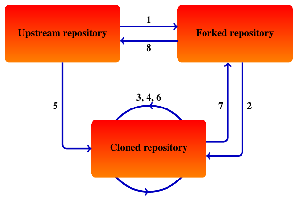

# PincFlow

## Introduction

PincFlow integrates the pseudo-incompressible equations in a conservative flux form, using either a third-order accurate Runge-Kutta method [(Rieper et al., 2013)](https://doi.org/10.1175/mwr-d-12-00026.1) or a semi-implicit method that combines explicit and implicit time-stepping schemes [(Schmid et al., 2021)](https://doi.org/10.1175/MWR-D-21-0126.1). The equations are discretized with a finite-volume method, such that all quantities are represented by spatial averages over grid cells and fluxes are computed on the respective cell interfaces. The grid is staggered so that the velocity components are defined at the same points as the corresponding fluxes of scalar quantities.

In an adiabatic configuration, the equations can also be solved above uneven ground, in which case PincFlow makes use of terrain-following methods based on [Gal-Chen and Somerville (1975a)](https://doi.org/10.1016/0021-9991(75)90037-6), [Gal-Chen and Somerville (1975b)](https://doi.org/10.1016/0021-9991(75)90054-6) and [Clark (1977)](https://doi.org/10.1016/0021-9991(77)90057-2). The topography can be set by specifying the corresponding namelist parameters. Topographic data can also be read from an appropriate input file (the topographic output of the model can be used as a reference).

The Lagrangian WKB model MS-GWaM is coupled interactively to PincFlow, such that unresolved gravity waves may be parameterized. The resolved fields are then updated according to the tendencies computed by the ray tracer at every Runge-Kutta substep. A description of MS-GWaM can be found in [Muraschko et al. (2014)](https://doi.org/10.1002/qj.2381), [Bölöni et al. (2016)](https://doi.org/10.1175/JAS-D-16-0069.1) and [Wilhelm et al. (2018)](https://doi.org/10.1175/JAS-D-17-0289.1).

## Code organization

In addition to the source code (`src`), the following resources are provided.

* A `Makefile` that can be used to compile the code with either `mpif90` or `mpiifort`, as well as a corresponding `CMakeLists.txt` file (`cmake`)

* Namelist files, run scripts, visualization tools and sample plots for a set of canonical test cases (`tests`)

* A code formatter that can be used to unify spacing, indentation and line breaks of all Fortran files in a given directory (`tools`)

## Workflow

The code is shared in a GitLab repository. Any contributions to the code should adhere to the following workflow.

1. Create a fork from the upstream repository.

1. Clone the fork to create a local repository.

1. Make your changes on the development branch of the local repository.

1. Commit your changes in reproducible steps.

1. Pull the development branch of the upstream repository and merge it into the development branch of the local repository, resolving merge conflicts if necessary.

1. **Ensure that the model is stable and that all canonical tests reproduce the sample results.**

1. Push the development branch of the local repository to the fork.

1. Request to merge the development branch of the fork into the development branch of the upstream repository.

