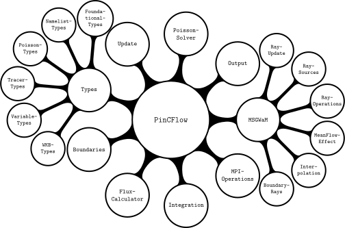
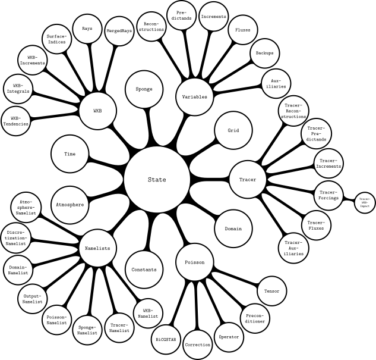

# Developer guide

## Workflow

The code is shared in a GitHub repository. Any contributions to the code should adhere to the following workflow.

 1. If you are new to the repository, clone it.

 1. Create a local branch for your contributions and commit your changes.

 1. Pull recent changes made on the remote main branch into your local main branch and merge it into the branch with your contributions, resolving merge conflicts if necessary.

 1. **Ensure that the model is stable and that all tests pass.**

 1. Push your branch to remote repository.

 1. Create a pull request for merging your commits into the remote main branch.

 1. Request a review from a main developer.

 1. Implement changes requested by the reviewer until they approve the pull request.

## Writing code

Contributions to the code should respect the following rules.

  - Put every module, composite type (including constructor methods) and function into a file on its own, with the file name matching that of the object. Create a folder for every module (see below for a diagram of PinCFlow.jl's modular structure).

  - Variables that are communicated between functions should be stored at an appropriate level of the `State` instance (see below for a diagram of PinCFlow.jl's model-state structure).

  - Use type parameters to declare the types of all composite-type fields.

  - Declare the types of all method arguments and the return types of all methods that return something other than `nothing`.

  - Use PinCFlow.jl's `@ivy` in front of expressions that access elements of arrays/tuples. Always apply this macro to the outermost expression possible but do not create new blocks for this purpose.

  - Do not use Unicode.

  - Use `CamelCase` for the names of modules and types. Use single capital letters for type parameters (in alphabetical order). For all other objects, use `snake_case`.





## Writing documentation

Contributions to the code should always be accompanied by corresponding contributions to the documentation, respecting the following rules.

  - Write a docstring for every module, function and type.

  - Module docstrings:

     1. Include the exact full signature within a Julia code block, followed by a single descriptive (pseudo-)sentence and (if needed) additional paragraphs with more details.

     1. List links to imported modules in a `# See also` section, with one bullet for each.

  - Function docstrings:

     1. For every method, include the exact full signature within a Julia code block, followed by a single, descriptive sentence in imperative form and (if needed) additional paragraphs with more details.

     1. List all positional and optional arguments with descriptions (but without types and default values) in an `# Arguments` section, with one bullet for each.

     1. List all keyword arguments with descriptions (but without types and default values) in a `# Keywords` section, with one bullet for each.

     1. List links to constructors/functions that are called in any of the function's methods in a `# See also` section, with one bullet for each.

  - Type docstrings:

     1. Include the exact full signature within a Julia code block, followed by a single descriptive (pseudo-)sentence and (if needed) a additional paragraphs with more details.

     1. If the type is composite, include the exact full signature within a Julia code block, followed by a single, descriptive sentence in imperative form and (if needed) additional paragraphs with more details, for each explicitly defined constructor method.

     1. If the type is composite, list all fields with their type restrictions and descriptions in a `# Fields` section, with one bullet for each.

     1. If the type is composite, list all positional and optional arguments of the explicitly defined constructor methods with descriptions (but without types and default values) in an `# Arguments` section, with one bullet for each.

     1. If the type is composite, list all keyword arguments of the explicitly defined constructor methods with descriptions (but without types and default values) in a `# Keywords` section, with one bullet for each.

     1. If the type is composite, list links to constructors/functions that are called in any of the explicitly defined constructor methods in a `# See also` section, with one bullet for each.

  - Use single backticks to identify code and double backticks to identify equations. Use LaTeX escape sequences instead of Unicode characters.

  - Place the starting and ending `"""` characters on lines by themselves.

## Markdown syntax

Markdown code should use the following syntax.

  - Headings:

    ```markdown
    # Heading level 1

    ## Heading level 2

    ### Heading level 3

    #### Heading level 4

    ##### Heading level 5

    ###### Heading level 6
    ```

  - Paragraphs:

    ```markdown
    This is the first paragraph.

    This is the second paragraph.
    ```

  - Emphasis:

    ```markdown
    This sentence contains *italic*, **bold** and ***italic bold*** words.
    ```

  - Block quotes:

    ```markdown
    This is a sentence above a block quote.

      > This is the first paragraph of a block quote.
      >
      >   > This is a nested block quote.
      >
      > This is the second paragraph of a block quote.

    This is a sentence below a block quote.

    ```

  - Unnumbered lists:

    ```markdown
    This is a sentence above an unnumbered list.

      - This is the first paragraph of the first item.

          - This is the first item of a nested list.

          - This is the second item of a nested list.

        This is the second paragraph of the first item.

      - This is the second item.

    This is a sentence below an unnumbered list.
    ```

  - Numbered lists:

    ```markdown
    This is a sentence above a numbered list.

     1. This is the first paragraph of the first item.

         1. This is the first item of a nested list.

         1. This is the second item of a nested list.

        This is the second paragraph of the first item.

     1. This is the second item.

     This is a sentence below a numbered list.
    ```

  - Inline code:

    ```markdown
    This sentence contains inline `code` and inline `` `nested code` ``.
    ```

  - Code blocks:

    `````````markdown
    This sentence contains the code block

    ```julia
    if true
        println("true")
    end
    ```

    and other stuff. This sentence contains the nested code blocks

    ``````markdown
    ```julia
    if true
        println("true")
    end
    ```
    ``````

    and other stuff.
    `````````

  - Horizontal rule:

    ```markdown
    ---
    ```

  - URLs and email addresses:

    ```markdown
    This sentence contains the URL <http://example.com> and the email address <fake@example.com>.
    ```

  - Links:

    ```markdown
    This sentence contains a [link](http://example.com).
    ```

  - Images:

    ```markdown
    
    ```

  - Backslash escapes:

    ```markdown
    This sentence contains the backslash escapes \\\`\*\_\{\}\[\]\(\)\#\+\-\.\!.
    ```

  - Inline math:

    ```markdown
    This sentence contains the equation $x^2 + y^2 = z^2$.
    ```

  - Centered math:

    ```markdown
    This sentence contains the equation

    $$x^2 + y^2 = z^2$$

    and other stuff.
    ```

In docstrings, the following syntax elements are different.

  - Inline math:

    ```markdown
    This sentence contains the equation ``x^2 + y^2 = z^2``.
    ```

  - Centered math:

    ``````markdown
    This sentence contains the equation

    ```math
    x^2 + y^2 = z^2
    ```

    and other stuff.
    ``````

Moreover, every backslash used for LaTeX commands in equations has to be doubled.

## Building and accessing the documentation

PinCFlow.jl uses [Documenter.jl](https://documenter.juliadocs.org/stable/). To build the documentation, run

```shell
julia --project=docs -e 'using Pkg; Pkg.develop(; path = "."); Pkg.instantiate()'
julia docs/make.jl
```

in the root directory of the repository. The documentation will be generated in the `docs/build` directory. To view it, open `docs/build/index.html` in a web browser or preview the file in Visual Studio Code with [Live Preview](https://marketplace.visualstudio.com/items?itemName=ms-vscode.live-server).

## Running and updating the tests

PinCFlow.jl's tests run the example simulations with a few modified parameters (most notably a lower resolution) and check if the $L_2$ and $L_\infty$ norms of the resulting outputs agree with reference values (given a certain tolerance). For this purpose, the example scripts are directly read, modified and evaluated in the test environment. To run the tests, execute

```shell
julia --project -e 'using Pkg; Pkg.test(; julia_args = `--check-bounds=auto`)'
```
in the root directory of the repository. To update the reference values for the norms, run the tests after setting the variable `update_references` in `test/runtests.jl` to `true`.

When you need to update the reference norms, please remember to also update the plots of the corresponding examples. Note that the exact results depend on the system and the level of parallelism you use. You may choose these freely.

## Creating new releases

The creation of a new release must not be attempted without the express permission of one of PinCFlow.jl's maintainers. To create a new release, first update the version numbers in `Project.toml`, `docs/Project.toml` and `examples/Project.toml` (following the interpretation of [semantic versioning](https://julialang.github.io/Pkg.jl/dev/compatibility/#Version-specifier-format-1)) and add the release notes to `NEWS.md`, documenting all relevant changes that have been implemented since the last release. Push your commit, navigate to it on GitHub and add the comment `@JuliaRegistrator register()`. If the release includes breaking changes, the comment must mention where they are documented (an example of this can be found [here](https://github.com/Atmospheric-Dynamics-GUF/PinCFlow.jl/commit/6049b83416104195e0575516d4d12f5614a6e0b1#commitcomment-170569001)).
