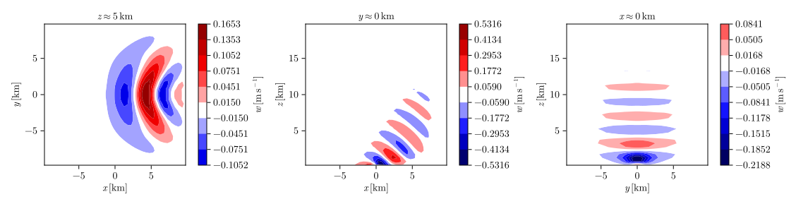
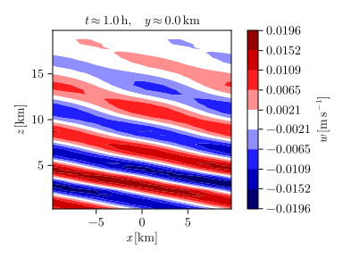
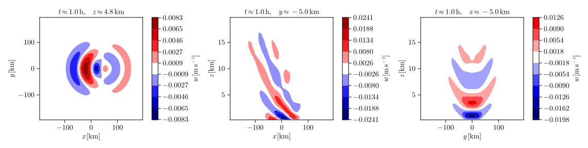

# Examples

## Cold bubble

The function

```julia
# src/Examples/cold_bubble.jl

function cold_bubble(;
    npx::Integer = 1,
    npy::Integer = 1,
    npz::Integer = 1,
    output_file::AbstractString = "cold_bubble.h5",
    plot_file::AbstractString = "cold_bubble.svg",
    prepare_restart::Bool = false,
    visualize::Bool = true,
    x_size::Integer = 20,
    y_size::Integer = 20,
    z_size::Integer = 20,
)
    lx = 10000
    ly = 10000
    lz = 10000

    rx = lx / 4
    ry = ly / 4
    rz = lz / 4

    atmosphere = AtmosphereNamelist(;
        background = :Isentropic,
        initial_rhop = (x, y, z) -> begin
            r = sqrt((x / rx)^2 + (y / ry)^2 + ((z - rz) / rz)^2)
            if r <= 1
                return 0.005 * (1 + cos(pi * r))
            else
                return 0.0
            end
        end,
    )

    discretization = DiscretizationNamelist(; dtmax = 60)

    domain = DomainNamelist(; lx, ly, lz, npx, npy, npz, x_size, y_size, z_size)

    output = OutputNamelist(;
        output_file,
        output_interval = 300,
        output_variables = [:thetap],
        prepare_restart,
        tmax = 300,
    )

    integrate(Namelists(; atmosphere, discretization, domain, output))

    if visualize && MPI.Comm_rank(MPI.COMM_WORLD) == 0
        plot_output(
            plot_file,
            output_file,
            (:thetap, 0.5, 0.5, 0.25, 2);
            time_unit = :min,
        )
    end

    return
end

```

simulates a cold bubble in a 3D pseudo-incompressible isentropic atmosphere and visualizes the potential-temperature fluctuations after five minutes integration time (see below).


## Hot bubble

The function

```julia
# src/Examples/hot_bubble.jl

function hot_bubble(;
    npx::Integer = 1,
    npy::Integer = 1,
    npz::Integer = 1,
    output_file::AbstractString = "hot_bubble.h5",
    plot_file::AbstractString = "hot_bubble.svg",
    prepare_restart::Bool = false,
    visualize::Bool = true,
    x_size::Integer = 20,
    y_size::Integer = 20,
    z_size::Integer = 20,
)
    lx = 10000
    ly = 10000
    lz = 10000

    rx = lx / 4
    ry = ly / 4
    rz = lz / 4

    atmosphere = AtmosphereNamelist(;
        background = :Isentropic,
        initial_rhop = (x, y, z) -> begin
            r = sqrt((x / rx)^2 + (y / ry)^2 + ((z - 3 * rz) / rz)^2)
            if r <= 1
                return -0.005 * (1 + cos(pi * r))
            else
                return 0.0
            end
        end,
        model = :Compressible,
    )

    discretization = DiscretizationNamelist(; dtmax = 60)

    domain = DomainNamelist(; lx, ly, lz, npx, npy, npz, x_size, y_size, z_size)

    output = OutputNamelist(;
        output_file,
        output_interval = 300,
        output_variables = [:thetap],
        prepare_restart,
        tmax = 300,
    )

    integrate(Namelists(; atmosphere, discretization, domain, output))

    if visualize && MPI.Comm_rank(MPI.COMM_WORLD) == 0
        plot_output(
            plot_file,
            output_file,
            (:thetap, 0.5, 0.5, 0.75, 2);
            time_unit = :min,
        )
    end

    return
end

```

simulates a hot bubble in a 3D compressible isentropic atmosphere and visualizes the potential-temperature fluctuations after five minutes integration time (see below).


## Mountain wave

The function

```julia
# src/Examples/mountain_wave.jl

function mountain_wave(;
    npx::Integer = 1,
    npy::Integer = 1,
    npz::Integer = 1,
    output_file::AbstractString = "mountain_wave.h5",
    plot_file::AbstractString = "mountain_wave.svg",
    prepare_restart::Bool = false,
    visualize::Bool = true,
    x_size::Integer = 20,
    y_size::Integer = 20,
    z_size::Integer = 20,
)
    h0 = 100
    l0 = 1000

    lx = 20000
    ly = 20000
    lz = 5000

    dxr = lx / 2
    dyr = ly / 2
    dzr = lz / 2
    alpharmax = 0.0179

    atmosphere = AtmosphereNamelist(;
        coriolis_frequency = 0.0,
        initial_u = (x, y, z) -> 10.0,
    )

    domain = DomainNamelist(; lx, ly, lz, npx, npy, npz, x_size, y_size, z_size)

    grid = GridNamelist(;
        resolved_topography = (x, y) -> h0 / (1 + (x^2 + y^2) / l0^2),
    )

    output = OutputNamelist(;
        output_file,
        output_interval = 600,
        output_variables = [:w],
        prepare_restart,
        tmax = 600,
    )

    sponge = SpongeNamelist(;
        lhs_sponge = (x, y, z, t, dt) -> begin
            alpharx =
                abs(x) >= (lx - dxr) / 2 ?
                sin(pi * (abs(x) - (lx - dxr) / 2) / dxr)^2 : 0.0
            alphary =
                abs(y) >= (ly - dyr) / 2 ?
                sin(pi * (abs(y) - (ly - dyr) / 2) / dyr)^2 : 0.0
            alpharz =
                z >= lz - dzr ? sin(pi / 2 * (z - (lz - dzr)) / dzr)^2 : 0.0
            return alpharmax * (alpharx + alphary + alpharz) / 3
        end,
        relaxed_u = (x, y, z, t, dt) -> 10.0,
    )

    integrate(Namelists(; atmosphere, domain, grid, output, sponge))

    if visualize && MPI.Comm_rank(MPI.COMM_WORLD) == 0
        plot_output(
            plot_file,
            output_file,
            (:w, 0.5, 0.5, 0.25, 2);
            time_unit = :min,
        )
    end

    return
end

```

performs a 3D mountain-wave simulation. The surface topography is given by

$$h \left(x, y\right) = \frac{h_0}{1 + \left(x^2 + y^2\right) / l_0^2},$$

with $h_0 = 100 \ \mathrm{m}$ and $l_0 = 1 \ \mathrm{km}$. The atmosphere is isothermal, with the default temperature $T_0 = 300 \ \mathrm{K}$ and the initial wind $\boldsymbol{u}_0 = \left(10, 0, 0\right)^\mathrm{T} \ \mathrm{m \ s^{- 1}}$.

Reflections at the upper boundary are prevented by damping the generated mountain waves in a sponge defined by

$$\alpha_\mathrm{R} \left(x, y, z\right) = \alpha_{\mathrm{R}, \max} \frac{\alpha_{\mathrm{R}, x} \left(x\right) + \alpha_{\mathrm{R}, y} \left(y\right) + \alpha_{\mathrm{R}, z} \left(z\right)}{3}$$

with

$$\begin{align*}
    \alpha_{\mathrm{R}, x} \left(x\right) & = \begin{cases}
        \sin^2 \left[\pi \frac{\left|x\right| - \left(L_x - \Delta x_\mathrm{R}\right) / 2}{\Delta x_\mathrm{R}}\right] & \mathrm{if} \quad \left|x\right| \geq \frac{1}{2} \left(L_x - \Delta x_\mathrm{R}\right),\\
        0 & \mathrm{else},
    \end{cases}\\
    \alpha_{\mathrm{R}, y} \left(y\right) & = \begin{cases}
        \sin^2 \left[\pi \frac{\left|y\right| - \left(L_y - \Delta y_\mathrm{R}\right) / 2}{\Delta y_\mathrm{R}}\right] & \mathrm{if} \quad \left|y\right| \geq \frac{1}{2} \left(L_y - \Delta y_\mathrm{R}\right),\\
        0 & \mathrm{else},
    \end{cases}\\
    \alpha_{\mathrm{R}, z} \left(z\right) & = \begin{cases}
        \sin^2 \left[\frac{\pi}{2} \frac{z - \left(L_z - \Delta z_\mathrm{R}\right)}{\Delta z_\mathrm{R}}\right] & \mathrm{if} \quad z \geq L_z - \Delta z_\mathrm{R},\\
        0 & \mathrm{else},
    \end{cases}
\end{align*}$$

where $\alpha_{\mathrm{R}, \max} = 0.0179 \ \mathrm{s^{- 1}}$, $\Delta x_\mathrm{R} = L_x / 2$, $\Delta y_\mathrm{R} = L_y / 2$ and $\Delta z_\mathrm{R} = L_z / 2$. This sponge not only prevents wave reflections at the model top but also provides a damping at the horizontal boundaries. Moreover, it is configured such that the wind is relaxed towards its initial state, so that (in the ideal case) the periodicity in $x$ and $y$ is effectively eliminated by enforcing a constant wind at the domain edges.

After the simulation has finished, the vertical wind is visualized (see below).



## Periodic hill

The function

```julia
# src/Examples/periodic_hill.jl

function periodic_hill(;
    npx::Integer = 1,
    npz::Integer = 1,
    output_file::AbstractString = "periodic_hill.h5",
    plot_file::AbstractString = "periodic_hill.svg",
    prepare_restart::Bool = false,
    visualize::Bool = true,
    x_size::Integer = 20,
    y_size::Integer = 1,
    z_size::Integer = 20,
)
    h0 = 500
    l0 = 10000

    lz = 20000
    zr = 10000

    atmosphere = AtmosphereNamelist(;
        background = :StableStratification,
        coriolis_frequency = 0.0,
        initial_u = (x, y, z) -> 10.0,
        model = :Boussinesq,
    )

    domain = DomainNamelist(; lx = 20000, lz, npx, npz, x_size, y_size, z_size)

    grid = GridNamelist(;
        resolved_topography = (x, y) -> h0 / 2 * (1 + cos(pi / l0 * x)),
    )

    output =
        OutputNamelist(; output_file, output_variables = [:w], prepare_restart)

    sponge = SpongeNamelist(;
        rhs_sponge = (x, y, z, t, dt) ->
            z >= zr ? sin(pi / 2 * (z - zr) / (lz - zr))^2 / dt : 0.0,
    )

    integrate(Namelists(; atmosphere, domain, grid, output, sponge))

    if visualize && MPI.Comm_rank(MPI.COMM_WORLD) == 0
        plot_output(plot_file, output_file, (:w, 2))
    end

    return
end

```

simulates a gravity wave generated above a periodic hill in a 2D Boussinesq atmosphere and visualizes the vertical wind after one hour integration time (see below).



## Vortex

The function

```julia
# src/Examples/vortex.jl

function vortex(;
    npx::Integer = 1,
    npy::Integer = 1,
    output_file::AbstractString = "vortex.h5",
    plot_file::AbstractString = "vortex.svg",
    prepare_restart::Bool = false,
    visualize::Bool = true,
    x_size::Integer = 20,
    y_size::Integer = 20,
    z_size::Integer = 1,
)
    lx = 20000
    ly = 20000

    rx = lx / 4
    ry = ly / 4

    atmosphere = AtmosphereNamelist(;
        model = :Boussinesq,
        background = :NeutralStratification,
        initial_u = (x, y, z) -> begin
            r = sqrt((x / rx)^2 + (y / ry)^2)
            if r <= 1
                return -5 * y / ry * (1 + cos(pi * r)) / 2
            else
                return 0.0
            end
        end,
        initial_v = (x, y, z) -> begin
            r = sqrt((x / rx)^2 + (y / ry)^2)
            if r <= 1
                return 5 * x / rx * (1 + cos(pi * r)) / 2
            else
                return 0.0
            end
        end,
    )

    domain = DomainNamelist(; lx, ly, npx, npy, x_size, y_size, z_size)

    output = OutputNamelist(;
        output_file,
        output_variables = [:chi],
        prepare_restart,
    )

    tracer = TracerNamelist(;
        tracer_setup = :TracerOn,
        initial_chi = (x, y, z) -> begin
            r = sqrt(((abs(x) - rx) / rx)^2 + (y / ry)^2)
            if r <= 1
                return sign(x) * (1 + cos(pi * r)) / 2
            else
                return 0.0
            end
        end,
    )

    integrate(Namelists(; atmosphere, domain, output, tracer))

    if visualize && MPI.Comm_rank(MPI.COMM_WORLD) == 0
        plot_output(plot_file, output_file, (:chi, 2))
    end

    return
end

```

initializes two tracer disks and a vortex in a 2D horizontal Boussinesq atmosphere, integrates over one hour and visualizes the resulting tracer distribution (see below).


## Wave packet

The function

```julia
# src/Examples/wave_packet.jl

function wave_packet(;
    npx::Integer = 1,
    npy::Integer = 1,
    npz::Integer = 1,
    output_file::AbstractString = "wave_packet.h5",
    plot_file::AbstractString = "wave_packet.svg",
    prepare_restart::Bool = false,
    visualize::Bool = true,
    x_size::Integer = 20,
    y_size::Integer = 20,
    z_size::Integer = 20,
)
    z0 = 10000

    lx = 20000
    ly = 20000
    lz = 30000

    parameters = (
        k = 8 * pi / lx,
        l = 8 * pi / ly,
        m = 8 * pi / (lz - z0),
        rx = 0.5,
        ry = 0.5,
        rz = 0.5,
        x0 = 0.0,
        y0 = 0.0,
        z0 = 20000,
        a0 = 0.05,
    )

    background = :Realistic
    coriolis_frequency = 0.0001

    atmosphere = AtmosphereNamelist(; background, coriolis_frequency)

    domain = DomainNamelist(; lx, ly, lz, npx, npy, npz, x_size, y_size, z_size)

    grid = GridNamelist(; resolved_topography = (x, y) -> z0)

    state = State(Namelists(; atmosphere, domain, grid))
    (; g) = state.constants

    atmosphere = AtmosphereNamelist(;
        background,
        buoyancy_initialization = :initial_thetap,
        coriolis_frequency,
        initial_pip = (x, y, z) -> real(
            pihat(state, parameters, x, y, z) *
            exp(1im * phi(parameters, x, y, z)),
        ),
        initial_thetap = (x, y, z) ->
            real(
                bhat(state, parameters, x, y, z) *
                exp(1im * phi(parameters, x, y, z)),
            ) / g * thetabar(state, x, y, z),
        initial_u = (x, y, z) -> real(
            uhat(state, parameters, x, y, z) *
            exp(1im * phi(parameters, x, y, z)),
        ),
        initial_v = (x, y, z) -> real(
            vhat(state, parameters, x, y, z) *
            exp(1im * phi(parameters, x, y, z)),
        ),
        initial_w = (x, y, z) -> real(
            what(state, parameters, x, y, z) *
            exp(1im * phi(parameters, x, y, z)),
        ),
    )

    output = OutputNamelist(;
        output_file,
        output_interval = 600,
        output_variables = [:u, :v, :w],
        prepare_restart,
        tmax = 600,
    )

    integrate(Namelists(; atmosphere, domain, grid, output))

    if visualize && MPI.Comm_rank(MPI.COMM_WORLD) == 0
        plot_output(
            plot_file,
            output_file,
            (:u, 0.5, 0.5, 0.5, 2),
            (:v, 0.5, 0.5, 0.5, 2),
            (:w, 0.5, 0.5, 0.5, 2);
            time_unit = :min,
        )
    end

    return
end

```

initializes a resolved gravity-wave packet in the stratosphere of a "realistic" atmosphere (isentropic troposphere and isothermal stratosphere) and visualizes the resulting wind after ten minutes integration time (see below). For the relatively complex initialization, this script first constructs an auxiliary state that contains the necessary background fields and then uses helper functions that implement the gravity-wave dispersion and polarization relations (organized in the module `WavePacketTools` and included in a section below).


## WKB mountain wave

The function

```julia
# src/Examples/wkb_mountain_wave.jl

function wkb_mountain_wave(;
    npx::Integer = 1,
    npy::Integer = 1,
    npz::Integer = 1,
    output_file::AbstractString = "wkb_mountain_wave.h5",
    plot_file::AbstractString = "wkb_mountain_wave.svg",
    prepare_restart::Bool = false,
    visualize::Bool = true,
    x_size::Integer = 20,
    y_size::Integer = 20,
    z_size::Integer = 20,
)
    h0 = 300
    l0 = 5000
    rl = 10
    rh = 2

    lx = 200000
    ly = 200000
    lz = 5000

    dxr = lx / 20
    dyr = ly / 20
    dzr = lz / 10
    alpharmax = 0.0179

    atmosphere = AtmosphereNamelist(;
        coriolis_frequency = 0.0,
        initial_u = (x, y, z) -> 10.0,
    )

    domain = DomainNamelist(; lx, ly, lz, npx, npy, npz, x_size, y_size, z_size)

    grid = GridNamelist(;
        resolved_topography = (x, y) ->
            x^2 + y^2 <= (rl * l0)^2 ?
            h0 / 2 * (1 + cos(pi / (rl * l0) * sqrt(x^2 + y^2))) * rh /
            (rh + 1) : 0.0,
        unresolved_topography = (alpha, x, y) ->
            x^2 + y^2 <= (rl * l0)^2 ?
            (
                pi / l0,
                0.0,
                h0 / 2 * (1 + cos(pi / (rl * l0) * sqrt(x^2 + y^2))) / (rh + 1),
            ) : (0.0, 0.0, 0.0),
    )

    output = OutputNamelist(;
        output_file,
        output_interval = 300,
        output_variables = [:uw],
        prepare_restart,
        tmax = 300,
    )

    sponge = SpongeNamelist(;
        lhs_sponge = (x, y, z, t, dt) ->
            alpharmax / 3 * (
                exp((abs(x) - lx / 2) / dxr) +
                exp((abs(y) - ly / 2) / dyr) +
                exp((z - lz) / dzr)
            ),
        relaxed_u = (x, y, z, t, dt) -> 10.0,
    )

    wkb = WKBNamelist(; wkb_mode = :MultiColumn)

    integrate(Namelists(; atmosphere, domain, grid, output, sponge, wkb))

    if visualize && MPI.Comm_rank(MPI.COMM_WORLD) == 0
        plot_output(
            plot_file,
            output_file,
            (:uw, 0.5, 0.5, 0.25, 2);
            time_unit = :min,
        )
    end

    return
end

```

performs a 3D WKB mountain-wave simulation. The full surface topography is given by

$$\begin{align*}
    h \left(x, y\right) & = \begin{cases}
        \frac{h_0}{2 \left(r_h + 1\right)} \left[1 + \cos \left(\frac{\pi}{r_l l_0} \sqrt{x^2 + y^2}\right)\right] \left[r_h + \cos \left(\frac{\pi x}{l_0}\right)\right] & \mathrm{if} \quad x^2 + y^2 \leq r_l^2 l_0^2,\\
        0 & \mathrm{else},
    \end{cases}\\
\end{align*}$$

where $h_0 = 150 \ \mathrm{m}$, $l_0 = 5 \ \mathrm{km}$, $r_h = 2$, and $r_l = 10$. This is decomposed into a large-scale part $h_\mathrm{b}$ and a small-scale part with the spectral amplitude $h_\mathrm{w}$, such that

$$\begin{align*}
    h_\mathrm{b} \left(x, y\right) & = r_h h_\mathrm{w} \left(x, y\right),\\
    h_\mathrm{w} \left(x, y\right) & = \begin{cases}
        \frac{h_0}{2 \left(r_h + 1\right)} \left[1 + \cos \left(\frac{\pi}{r_l l_0} \sqrt{x^2 + y^2}\right)\right] & \mathrm{if} \quad x^2 + y^2 \leq r_l^2 l_0^2,\\
        0 & \mathrm{else}.
    \end{cases}
\end{align*}$$

The large-scale part is resolved, so that the grid is defined from it, whereas the small-scale part is used by MS-GWaM to parameterize the mountain waves generated by the resolved wind crossing it. As in the first mountain-wave example, the atmosphere is isothermal, with the default temperature $T_0 = 300 \ \mathrm{K}$ and the initial wind $\boldsymbol{u}_0 = \left(10, 0, 0\right)^\mathrm{T} \ \mathrm{m \ s^{- 1}}$.

The damping coefficient of the sponge is given by

$$\alpha_\mathrm{R} \left(x, y, z\right) = \frac{\alpha_{\mathrm{R}, \max}}{3} \left[\exp \left(\frac{\left|x\right| - L_x / 2}{\Delta x_\mathrm{R}}\right) + \exp \left(\frac{\left|y\right| - L_y / 2}{\Delta y_\mathrm{R}}\right) + \exp \left(\frac{z - L_z}{\Delta z_\mathrm{R}}\right)\right],$$

where $\alpha_{\mathrm{R}, \max} = 0.0179 \ \mathrm{s^{- 1}}$, $\Delta x_\mathrm{R} = L_x / 20$, $\Delta y_\mathrm{R} = L_y / 20$ and $\Delta z_\mathrm{R} = L_z / 10$. In contrast to the sinusoidal sponge discussed in the first example, this sponge applies a damping everywhere in the domain (weakest at the center of the surface, strongest in the upper corners). Once again, the sponge relaxes the wind to its initial state.

MS-GWaM is used with most of its parameters set to their default values. This means that the orographic source launches exactly one ray volume in each surface grid cell with a nonzero $h_\mathrm{w}$. Thus, the number of ray volumes allowed per grid cell (before merging is triggered) is `k_bins * l_bins * m_bins` (from `WKBNamelist`), which equals three.

Instead of the resolved dynamics, the above script visualizes the zonal vertical-momentum flux calculated by MS-GWaM (see below).



## WKB wave packet

The function

```julia
# src/Examples/wkb_wave_packet.jl

function wkb_wave_packet(;
    npx::Integer = 1,
    npy::Integer = 1,
    npz::Integer = 1,
    output_file::AbstractString = "wkb_wave_packet.h5",
    plot_file::AbstractString = "wkb_wave_packet.svg",
    prepare_restart::Bool = false,
    visualize::Bool = true,
    x_size::Integer = 20,
    y_size::Integer = 20,
    z_size::Integer = 20,
)
    z0 = 10000

    lx = 20000
    ly = 20000
    lz = 30000

    parameters = (
        k = 8 * pi / lx,
        l = 8 * pi / ly,
        m = 8 * pi / lz,
        rx = 0.5,
        ry = 0.5,
        rz = 0.5,
        x0 = 0.0,
        y0 = 0.0,
        z0 = 20000,
        a0 = 0.05,
    )
    (; k, l, m) = parameters

    model = :Compressible
    background = :LapseRates
    coriolis_frequency = 0.0001

    atmosphere = AtmosphereNamelist(; background, coriolis_frequency, model)

    domain = DomainNamelist(; lx, ly, lz, npx, npy, npz, x_size, y_size, z_size)

    grid = GridNamelist(; resolved_topography = (x, y) -> z0)

    output = OutputNamelist(;
        output_file,
        output_interval = 600,
        output_variables = [:uw],
        prepare_restart,
        tmax = 600,
    )

    state = State(Namelists(; atmosphere, domain))

    wkb = WKBNamelist(;
        wkb_mode = :MultiColumn,
        initial_wave_field = (alpha, x, y, z) -> (
            k,
            l,
            m,
            omega(state, parameters, x, y, z),
            wave_action_density(state, parameters, x, y, z),
        ),
    )

    integrate(Namelists(; atmosphere, domain, grid, output, wkb))

    if visualize && MPI.Comm_rank(MPI.COMM_WORLD) == 0
        plot_output(
            plot_file,
            output_file,
            (:uw, 0.5, 0.5, 0.5, 2);
            time_unit = :min,
        )
    end

    return
end

```

initializes an unresolved gravity-wave packet (i.e. one that is parameterized by MS-GWaM) in the stratosphere of a compressible atmosphere with two different lapse rates and visualizes the resulting zonal vertical-momentum flux after ten minutes integration time (see below). Like the wave-packet script discussed above, it constructs an auxiliary state and uses helper functions to satisfy the gravity-wave dispersion and polarization relations.


## Wave-packet helper functions

The `Examples` module contains another module called `WavePacketTools`, which provides the helper functions

```julia
# src/Examples/WavePacketTools/ijk.jl

@ivy function ijk(state::State, x::Real, y::Real, z::Real)::CartesianIndex
    (; lref) = state.constants
    (; grid) = state

    i = argmin(abs.(x .- grid.x .* lref))
    j = argmin(abs.(y .- grid.y .* lref))
    k = argmin(abs.(z .- grid.zc[i, j, :] .* lref))

    return CartesianIndex(i, j, k)
end

```

```julia
# src/Examples/WavePacketTools/rhobar.jl

@ivy function rhobar(state::State, x::Real, y::Real, z::Real)::Real
    (; atmosphere) = state
    (; rhoref) = state.constants

    return atmosphere.rhobar[ijk(state, x, y, z)] .* rhoref
end

```

```julia
# src/Examples/WavePacketTools/thetabar.jl

@ivy function thetabar(state::State, x::Real, y::Real, z::Real)::Real
    (; atmosphere) = state
    (; thetaref) = state.constants

    return atmosphere.thetabar[ijk(state, x, y, z)] .* thetaref
end

```

```julia
# src/Examples/WavePacketTools/n2.jl

@ivy function n2(state::State, x::Real, y::Real, z::Real)::Real
    (; atmosphere) = state
    (; tref) = state.constants

    return atmosphere.n2[ijk(state, x, y, z)] ./ tref .^ 2
end

```

```julia
# src/Examples/WavePacketTools/envelope.jl

function envelope(parameters::NamedTuple, x::Real, y::Real, z::Real)::Real
    (; k, l, m, rx, ry, rz, x0, y0, z0) = parameters

    r =
        sqrt(
            (rx * k * (x - x0))^2 +
            (ry * l * (y - y0))^2 +
            (rz * m * (z - z0))^2,
        ) / pi
    if r <= 1
        return (1 + cos(pi * r)) / 2
    else
        return 0.0
    end
end

```

```julia
# src/Examples/WavePacketTools/phi.jl

function phi(parameters::NamedTuple, x::Real, y::Real, z::Real)::Real
    (; k, l, m) = parameters

    return k * x + l * y + m * z
end

```

```julia
# src/Examples/WavePacketTools/omega.jl

function omega(
    state::State,
    parameters::NamedTuple,
    x::Real,
    y::Real,
    z::Real,
)::Real
    (; coriolis_frequency) = state.namelists.atmosphere
    (; k, l, m) = parameters

    return -sqrt(
        (n2(state, x, y, z) * (k^2 + l^2) + coriolis_frequency^2 * m^2) /
        (k^2 + l^2 + m^2),
    )
end

```

```julia
# src/Examples/WavePacketTools/bhat.jl

function bhat(
    state::State,
    parameters::NamedTuple,
    x::Real,
    y::Real,
    z::Real,
)::Real
    (; a0, m) = parameters

    return a0 * n2(state, x, y, z) / m * envelope(parameters, x, y, z)
end

```

```julia
# src/Examples/WavePacketTools/uhat.jl

function uhat(
    state::State,
    parameters::NamedTuple,
    x::Real,
    y::Real,
    z::Real,
)::Number
    (; coriolis_frequency) = state.namelists.atmosphere
    (; k, l, m) = parameters

    return n2(state, x, y, z) == 0.0 ? 0.0 :
           1im / m / n2(state, x, y, z) *
           (omega(state, parameters, x, y, z)^2 - n2(state, x, y, z)) /
           (omega(state, parameters, x, y, z)^2 - coriolis_frequency^2) *
           (
               k * omega(state, parameters, x, y, z) +
               1im * l * coriolis_frequency
           ) *
           bhat(state, parameters, x, y, z)
end

```

```julia
# src/Examples/WavePacketTools/vhat.jl

function vhat(
    state::State,
    parameters::NamedTuple,
    x::Real,
    y::Real,
    z::Real,
)::Number
    (; coriolis_frequency) = state.namelists.atmosphere
    (; k, l, m) = parameters

    return n2(state, x, y, z) == 0.0 ? 0.0 :
           1im / m / n2(state, x, y, z) *
           (omega(state, parameters, x, y, z)^2 - n2(state, x, y, z)) /
           (omega(state, parameters, x, y, z)^2 - coriolis_frequency^2) *
           (
               l * omega(state, parameters, x, y, z) -
               1im * k * coriolis_frequency
           ) *
           bhat(state, parameters, x, y, z)
end

```

```julia
# src/Examples/WavePacketTools/what.jl

function what(
    state::State,
    parameters::NamedTuple,
    x::Real,
    y::Real,
    z::Real,
)::Number
    return n2(state, x, y, z) == 0.0 ? 0.0 :
           1im * omega(state, parameters, x, y, z) / n2(state, x, y, z) *
           bhat(state, parameters, x, y, z)
end

```

```julia
# src/Examples/WavePacketTools/pihat.jl

function pihat(
    state::State,
    parameters::NamedTuple,
    x::Real,
    y::Real,
    z::Real,
)::Number
    (; kappa, rsp) = state.constants
    (; m) = parameters

    return n2(state, x, y, z) == 0.0 ? 0.0 :
           kappa / rsp / thetabar(state, x, y, z) * 1im / m *
           (omega(state, parameters, x, y, z)^2 - n2(state, x, y, z)) /
           n2(state, x, y, z) * bhat(state, parameters, x, y, z)
end

```

```julia
# src/Examples/WavePacketTools/wave_action_density.jl

function wave_action_density(
    state::State,
    parameters::NamedTuple,
    x::Real,
    y::Real,
    z::Real,
)::Real
    (; k, l, m) = parameters

    return n2(state, x, y, z) == 0.0 ? 0.0 :
           rhobar(state, x, y, z) / 2 *
           omega(state, parameters, x, y, z) *
           (k^2 + l^2 + m^2) / n2(state, x, y, z)^2 / (k^2 + l^2) *
           bhat(state, parameters, x, y, z)^2
end

```

that implement the gravity-wave dispersion and polarization relations needed for the initialization of wave packets.
