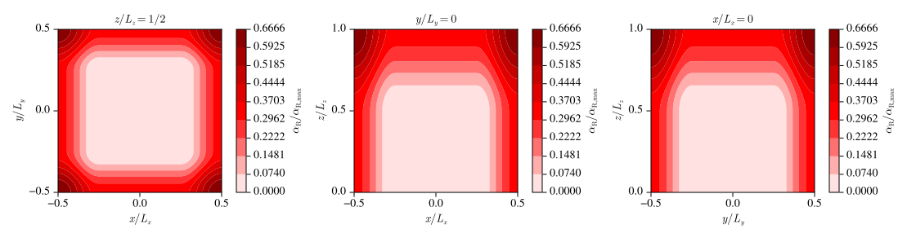
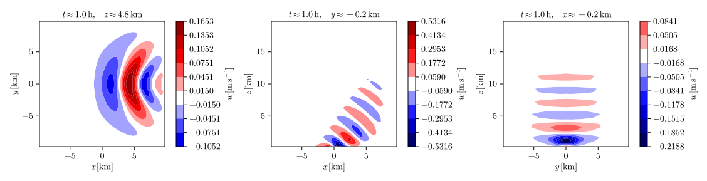

# Mountain-wave simulation

## Simulation

The script

```julia
# examples/submit/mountain_wave.jl

using Pkg

Pkg.activate("examples")

using Revise
using PinCFlow

npx = length(ARGS) >= 1 ? parse(Int, ARGS[1]) : 1
npy = length(ARGS) >= 2 ? parse(Int, ARGS[2]) : 1
npz = length(ARGS) >= 3 ? parse(Int, ARGS[3]) : 1

atmosphere = AtmosphereNamelist(;
    initial_wind = (1.0E+1, 0.0E+0, 0.0E+0),
    coriolis_frequency = 0.0E+0,
)
domain = DomainNamelist(;
    x_size = 40,
    y_size = 40,
    z_size = 40,
    lx = 2.0E+4,
    ly = 2.0E+4,
    lz = 2.0E+4,
    npx,
    npy,
    npz,
)
grid = GridNamelist(;
    resolved_topography = (namelists, x, y) ->
        100 / (1 + (x^2 + y^2) / 1000^2),
)
output =
    OutputNamelist(; output_variables = (:w,), output_file = "mountain_wave.h5")
sponge = SpongeNamelist(;
    alpharmax = 1.79E-2,
    lateral_sponge = true,
    sponge_type = SinusoidalSponge(),
    relax_to_mean = false,
    relaxation_wind = (1.0E+1, 0.0E+0, 0.0E+0),
)

integrate(Namelists(; atmosphere, domain, grid, output, sponge))

```

performs a 3D mountain-wave simulation in 64 MPI processes (4 for each dimension of physical space) and writes the vertical wind to `mountain_wave.h5`, if executed with

```shell
mpiexec=$(julia --project=examples -e 'using MPICH_jll; println(MPICH_jll.mpiexec_path)')
${mpiexec} -n 64 julia examples/submit/mountain_wave.jl 4 4 4
```

(provided the examples project has been set up as illustrated in the user guide and MPI.jl and HDF5.jl are configured to use their default backends). The surface topography is given by

$$h \left(x, y\right) = \frac{h_0}{1 + \left(x^2 + y^2\right) / l_0^2},$$

where the default values $h_0 = 100 \, \mathrm{m}$ and $l_0 = 1 \, \mathrm{km}$ are being used. The atmosphere is isothermal, with the default temperature $T_0 = 300 \, \mathrm{K}$ and the initial wind $\boldsymbol{u}_0 = \left(10, 0, 0\right)^\mathrm{T} \, \mathrm{m \, s^{- 1}}$.

Reflections at the upper boundary are prevented by damping the generated mountain waves in a sponge defined by

$$\alpha_\mathrm{R} \left(x, y, z\right) = \frac{\alpha_{\mathrm{R}, x} \left(x\right) + \alpha_{\mathrm{R}, y} \left(y\right) + \alpha_{\mathrm{R}, z} \left(z\right)}{3}$$

with

$$\begin{align*}
    \alpha_{\mathrm{R}, x} \left(x\right) & = \begin{cases}
        \alpha_{\mathrm{R}, \max} \sin^2 \left[\frac{\pi \left(x_{\mathrm{R}, 0} - x\right)}{2 \Delta x_\mathrm{R}}\right] & \mathrm{if} \quad x \leq x_{\mathrm{R}, 0},\\
        \alpha_{\mathrm{R}, \max} \sin^2 \left[\frac{\pi \left(x - x_{\mathrm{R}, 1}\right)}{2 \Delta x_\mathrm{R}}\right] & \mathrm{if} \quad x \geq x_{\mathrm{R}, 1},\\
        0 & \mathrm{else},
    \end{cases}\\
    \alpha_{\mathrm{R}, y} \left(y\right) & = \begin{cases}
        \alpha_{\mathrm{R}, \max} \sin^2 \left[\frac{\pi \left(y_{\mathrm{R}, 0} - y\right)}{2 \Delta y_\mathrm{R}}\right] & \mathrm{if} \quad y \leq y_{\mathrm{R}, 0},\\
        \alpha_{\mathrm{R}, \max} \sin^2 \left[\frac{\pi \left(y - y_{\mathrm{R}, 1}\right)}{2 \Delta y_\mathrm{R}}\right] & \mathrm{if} \quad y \geq y_{\mathrm{R}, 1},\\
        0 & \mathrm{else},
    \end{cases}\\
    \alpha_{\mathrm{R}, z} \left(z\right) & = \begin{cases}
        \alpha_{\mathrm{R}, \max} \sin^2 \left[\frac{\pi \left(z - z_\mathrm{R}\right)}{2 \Delta z_\mathrm{R}}\right] & \mathrm{if} \quad z \geq z_\mathrm{R},\\
        0 & \mathrm{else},
    \end{cases}
\end{align*}$$

where the maximum of the damping coefficient is $\alpha_{\mathrm{R}, \max} = 0.0179 \, \mathrm{s^{- 1}}$, which corresponds to the buoyancy frequency. Since the simulation uses the default setting `sponge_extent = 0.5`, the parameter $\Delta z_\mathrm{R}$ is given by half of the domain's vertical extent, whereas $\Delta x_\mathrm{R}$ and $\Delta y_\mathrm{R}$ are each given by a quarter of the domain's extent in the respective dimension. The edges of the sponge are such that it is horizontally centered at $\left(- 10, - 10\right)^\mathrm{T} \, \mathrm{km}$ and has an extent of $\left(\Delta x_\mathrm{R}, \Delta y_\mathrm{R}\right)^\mathrm{T}$ below $z_\mathrm{R} = 10 \, \mathrm{km}$, whereas it covers the entire horizontal plane above that altitude (see below for plots of $\alpha_\mathrm{R}$ in three cross sections of the domain). This means that the sponge not only prevents wave reflections at the model top but also provides a damping at the horizontal boundaries. Moreover, it is configured such that the wind is relaxed towards its initial state, so that (in the ideal case) the periodicity in $x$ and $y$ is effectively eliminated by enforcing a constant wind at the domain edges.



## Visualization

The script

```julia
# examples/visualization/mountain_wave.jl

using Pkg

Pkg.activate("examples")

using HDF5
using CairoMakie
using Revise
using PinCFlow

h5open("mountain_wave.h5") do data
    plot_contours(
        "examples/results/mountain_wave.svg",
        data,
        "w",
        (20, 20, 10, 2);
        label = L"w\,[\mathrm{m\,s^{-1}}]",
    )
    return
end

```

visualizes the vertical wind at the end of the above simulation (i.e. after one hour) in three cross sections of the domain and saves the generated figure to an SVG file that is included below.


