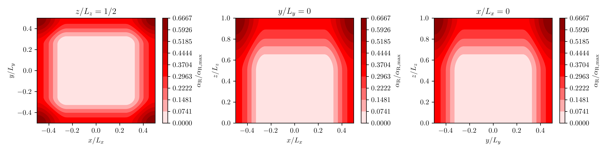
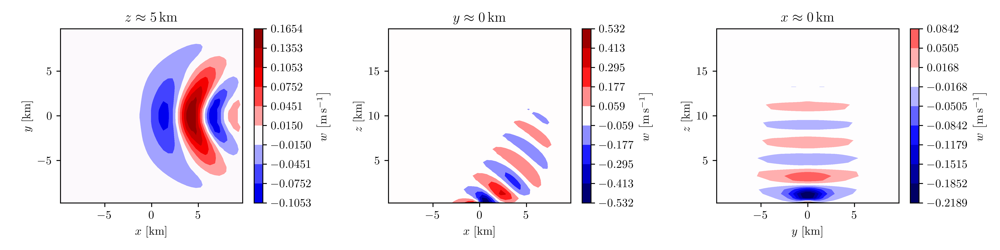

# Mountain-wave simulation

## Simulation

The script

```julia
# examples/submit/mountain_wave.jl

using PinCFlow

if length(ARGS) == 0
    output_file = "./pincflow_output.h5"
elseif length(ARGS) == 1
    output_file = ARGS[1] * "/pincflow_output.h5"
else
    error("Too many arguments to the script!")
end

atmosphere = AtmosphereNamelist(; backgroundflow_dim = (1.0E+1, 0.0E+0, 0.0E+0))
domain = DomainNamelist(;
    sizex = 40,
    sizey = 40,
    sizez = 40,
    lx_dim = 2.0E+4,
    ly_dim = 2.0E+4,
    lz_dim = 2.0E+4,
    npx = 8,
    npy = 8,
)
grid = GridNamelist(; mountain_case = 4)
output = OutputNamelist(; output_variables = (:w,), output_file = output_file)
sponge = SpongeNamelist(;
    spongelayer = true,
    alpharmax = 1.79E-2,
    betarmax = 0.0E+0,
    lateralsponge = true,
    spongetype = SinusoidalSponge(),
    relax_to_mean = false,
    relaxation_wind = (1.0E+1, 0.0E+0, 0.0E+0),
)

integrate(Namelists(; atmosphere, domain, grid, output, sponge))

```

performs a 3D mountain-wave simulation with parallelization in the zonal and meridional dimensions, and writes the vertical wind to `pincflow_output.h5`, if executed with

```shell
mpiexec=$(julia --project -e 'using MPICH_jll; println(MPICH_jll.mpiexec_path)')
${mpiexec} -n 64 julia --project --check-bounds=no --math-mode=fast examples/submit/mountain_wave.jl
```

from the root directory of the repository (provided MPI.jl and HDF5.jl are configured to use their default backends). The surface topography is given by

$$h \left(x, y\right) = \frac{h_0}{1 + \left(x^2 + y^2\right) / l_0^2},$$

where the default values $h_0 = 100 \, \mathrm{m}$ and $l_0 = 1 \, \mathrm{km}$ are being used. The atmosphere is isothermal, with the default temperature $T_0 = 300 \, \mathrm{K}$ and the initial wind $\boldsymbol{u}_0 = \left(10, 0, 0\right)^\mathrm{T} \, \mathrm{m \, s^{- 1}}$.

Reflections at the upper boundary are prevented by damping the generated mountain waves in a sponge defined by

$$\alpha_\mathrm{R} \left(x, y, z\right) = \frac{\alpha_{\mathrm{R}, x} \left(x\right) + \alpha_{\mathrm{R}, y} \left(y\right) + \alpha_{\mathrm{R}, z} \left(z\right)}{3}$$

with

$$\begin{align*}
    \alpha_{\mathrm{R}, x} \left(x\right) & = \begin{cases}
        \alpha_{\mathrm{R}, \max} \sin^2 \left[\frac{\pi \left(x_{\mathrm{R}, 0} - x\right)}{2 \Delta x_\mathrm{R}}\right] & \mathrm{if} \quad x \leq x_{\mathrm{R}, 0},\\
        \alpha_{\mathrm{R}, \max} \sin^2 \left[\frac{\pi \left(x - x_{\mathrm{R}, 1}\right)}{2 \Delta x_\mathrm{R}}\right] & \mathrm{if} \quad x \geq x_{\mathrm{R}, 1},\\
        0 & \mathrm{else},
    \end{cases}\\
    \alpha_{\mathrm{R}, y} \left(y\right) & = \begin{cases}
        \alpha_{\mathrm{R}, \max} \sin^2 \left[\frac{\pi \left(y_{\mathrm{R}, 0} - y\right)}{2 \Delta y_\mathrm{R}}\right] & \mathrm{if} \quad y \leq y_{\mathrm{R}, 0},\\
        \alpha_{\mathrm{R}, \max} \sin^2 \left[\frac{\pi \left(y - y_{\mathrm{R}, 1}\right)}{2 \Delta y_\mathrm{R}}\right] & \mathrm{if} \quad y \geq y_{\mathrm{R}, 1},\\
        0 & \mathrm{else},
    \end{cases}\\
    \alpha_{\mathrm{R}, z} \left(z\right) & = \begin{cases}
        \alpha_{\mathrm{R}, \max} \sin^2 \left[\frac{\pi \left(z - z_\mathrm{R}\right)}{2 \Delta z_\mathrm{R}}\right] & \mathrm{if} \quad z \geq z_\mathrm{R},\\
        0 & \mathrm{else},
    \end{cases}
\end{align*}$$

where the maximum of the damping coefficent is $\alpha_{\mathrm{R}, \max} = 0.0179 \, \mathrm{s^{- 1}}$, which corresponds to the buoyancy frequency. Since the simulation uses the default setting `spongeheight = 0.5`, the parameter $\Delta z_\mathrm{R}$ is given by half of the domain's vertical extent, whereas $\Delta x_\mathrm{R}$ and $\Delta y_\mathrm{R}$ are each given by a quarter of the domain's extent in the respective dimension. The edges of the sponge are such that it is horizontally centered at $\left(- 10, - 10\right)^\mathrm{T} \, \mathrm{km}$ and has an extent of $\left(\Delta x_\mathrm{R}, \Delta y_\mathrm{R}\right)^\mathrm{T}$ below $z_\mathrm{R} = 10 \, \mathrm{km}$, whereas it covers the entire horizontal plane above that altitude (see below for plots of $\alpha_\mathrm{R}$ in three cross sections of the domain). This means that the sponge not only prevents wave reflections at the model top but also provides a damping at the horizontal boundaries. Moreover, it is configured such that the wind is relaxed towards its initial state, so that (in the ideal case) the periodicity in $x$ and $y$ is effectively eliminated by enforcing a constant wind at the domain edges.



## Visualization

The script

```julia
# examples/visualization/mountain_wave.jl

using HDF5
using LaTeXStrings

include("style.jl")

# Import the data.
if length(ARGS) == 0
    data = h5open("./pincflow_output.h5")
elseif length(ARGS) == 1
    data = h5open(ARGS[1] * "/pincflow_output.h5")
else
    error("Too many arguments to the script!")
end

# Set the grid.
x = data["x"][:] ./ 1000
y = data["y"][:] ./ 1000
z = data["z"][:, :, :] ./ 1000
x = [xi for xi in x, j in size(z)[2], k in size(z)[3]]
y = [yj for i in size(z)[1], yj in y, k in size(z)[3]]

# Get the vertical wind.
w = data["w"][:, :, :, end]

# Close the file.
close(data)

# Create the figure.
figure(; figsize = (12, 3))

# Plot in x-y plane.
k = 10
subplot(131)
@views (levels, colormap) =
    symmetric_contours(minimum(w[:, :, k]), maximum(w[:, :, k]))
@views contours = contourf(
    x[:, :, k],
    y[:, :, k],
    w[:, :, k];
    levels = levels,
    cmap = colormap,
)
xlabel(L"x\,\left[\mathrm{km}\right]")
ylabel(L"y\,\left[\mathrm{km}\right]")
title(L"z\approx 5\,\mathrm{km}")
colorbar(contours; label = L"w\,\left[\mathrm{m\,s^{-1}}\right]")

# Plot in x-z plane.
j = 20
subplot(132)
@views (levels, colormap) =
    symmetric_contours(minimum(w[:, j, :]), maximum(w[:, j, :]))
@views contours = contourf(
    x[:, j, :],
    z[:, j, :],
    w[:, j, :];
    levels = levels,
    cmap = colormap,
)
@views plot(x[:, j, 1], z[:, j, 1]; color = "black", linewidth = 0.5)
xlabel(L"x\,\left[\mathrm{km}\right]")
ylabel(L"z\,\left[\mathrm{km}\right]")
title(L"y\approx 0\,\mathrm{km}")
colorbar(contours; label = L"w\,\left[\mathrm{m\,s^{-1}}\right]")

# Plot in y-z plane.
i = 20
subplot(133)
@views (levels, colormap) =
    symmetric_contours(minimum(w[i, :, :]), maximum(w[i, :, :]))
@views contours = contourf(
    y[i, :, :],
    z[i, :, :],
    w[i, :, :];
    levels = levels,
    cmap = colormap,
)
@views plot(y[i, :, 1], z[i, :, 1]; color = "black", linewidth = 0.5)
xlabel(L"y\,\left[\mathrm{km}\right]")
ylabel(L"z\,\left[\mathrm{km}\right]")
title(L"x\approx 0\,\mathrm{km}")
colorbar(contours; label = L"w\,\left[\mathrm{m\,s^{-1}}\right]")

# Save the figure.
savefig("examples/results/mountain_wave.png")
clf()

```

visualizes the vertical wind at the end of the above simulation (i.e. after one hour) in three cross sections of the domain and saves the generated figure to a PNG file that is included below. Note that the `symmetric_countours` function returns a cropped colormap that is centered at $w = 0 \, \mathrm{m \, s^{- 1}}$.



## See also

  - [`PinCFlow.Types.NamelistTypes.AtmosphereNamelist`](@ref)

  - [`PinCFlow.Types.NamelistTypes.GridNamelist`](@ref)

  - [`PinCFlow.Types.NamelistTypes.SpongeNamelist`](@ref)

  - [`PinCFlow.Types.FoundationalTypes.compute_topography`](@ref)

  - [`PinCFlow.Types.FoundationalTypes.Sponge`](@ref)

  - [`PinCFlow.Update.compute_sponges!`](@ref)

  - [`PinCFlow.Update.apply_lhs_sponge!`](@ref)
