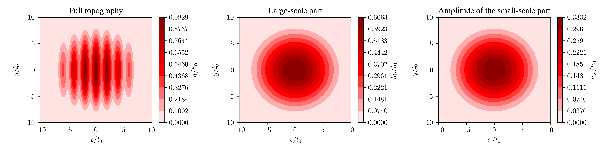
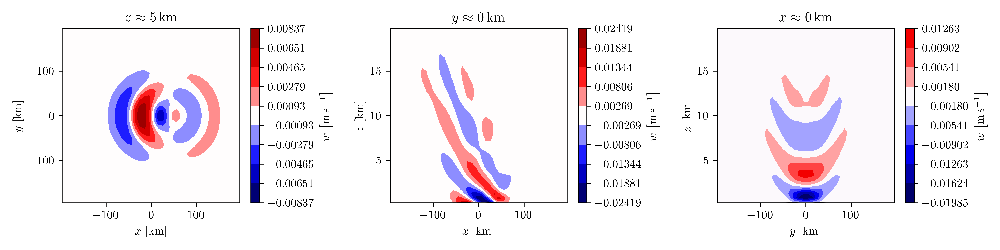

# WKB mountain-wave simulation

## Simulation

The script

```julia
# examples/submit/wkb_mountain_wave.jl

using PinCFlow

@ivy if length(ARGS) == 0
    output_file = "./pincflow_output.h5"
elseif length(ARGS) == 1
    output_file = ARGS[1] * "/pincflow_output.h5"
else
    error("Too many arguments to the script!")
end

atmosphere = AtmosphereNamelist(; backgroundflow_dim = (1.0E+1, 0.0E+0, 0.0E+0))
domain = DomainNamelist(;
    sizex = 40,
    sizey = 40,
    sizez = 40,
    nbx = 3,
    nby = 3,
    nbz = 3,
    lx_dim = 4.0E+5,
    ly_dim = 4.0E+5,
    lz_dim = 2.0E+4,
    npx = 8,
    npy = 8,
)
grid = GridNamelist(;
    mountainheight_dim = 1.5E+2,
    mountainwidth_dim = 5.0E+3,
    mountain_case = 13,
    height_factor = 2.0E+0,
    width_factor = 1.0E+1,
)
output = OutputNamelist(; output_variables = (:w,), output_file = output_file)
setting = SettingNamelist(; testcase = WKBMountainWave())
sponge = SpongeNamelist(;
    spongelayer = true,
    spongeheight = 1.0E-1,
    alpharmax = 1.79E-2,
    betarmax = 0.0E+0,
    lateralsponge = true,
    spongetype = ExponentialSponge(),
    relax_to_mean = false,
    relaxation_wind = (1.0E+1, 0.0E+0, 0.0E+0),
)
wkb = WKBNamelist(;
    xrmin_dim = -2.0E+5,
    xrmax_dim = 2.0E+5,
    yrmin_dim = -2.0E+5,
    yrmax_dim = 2.0E+5,
    zrmin_dim = 0.0,
    zrmax_dim = 2.0E+4,
)

integrate(Namelists(; atmosphere, domain, grid, output, setting, sponge, wkb))

```

performs a 3D WKB mountain-wave simulation with parallelization in the zonal and meridional dimensions, and writes the vertical wind to `pincflow_output.h5`, if executed with

```shell
mpiexec=$(julia --project -e 'using MPICH_jll; println(MPICH_jll.mpiexec_path)')
${mpiexec} -n 64 julia --project examples/submit/wkb_mountain_wave.jl
```

from the root directory of the repository (provided MPI.jl and HDF5.jl are configured to use their default backends). The full surface topography is given by

$$\begin{align*}
    h \left(x, y\right) & = \begin{cases}
        \frac{h_0}{2 \left(r_h + 1\right)} \left[1 + \cos \left(\frac{\pi}{r_l l_0} \sqrt{x^2 + y^2}\right)\right] \left[r_h + \cos \left(\frac{\pi x}{l_0}\right)\right] & \mathrm{if} \quad x^2 + y^2 \leq r_l^2 l_0^2,\\
        0 & \mathrm{else},
    \end{cases}\\
\end{align*}$$

where $h_0 = 150 \, \mathrm{m}$, $l_0 = 5 \, \mathrm{km}$, $r_h = 2$, and $r_l = 10$. This is decomposed into a large-scale part $h_\mathrm{b}$ and a small-scale part with the spectral amplitude $h_\mathrm{w}$, such that

$$\begin{align*}
    h_\mathrm{b} \left(x, y\right) & = r_h h_\mathrm{w} \left(x, y\right),\\
    h_\mathrm{w} \left(x, y\right) & = \begin{cases}
        \frac{h_0}{2 \left(r_h + 1\right)} \left[1 + \cos \left(\frac{\pi}{r_l l_0} \sqrt{x^2 + y^2}\right)\right] & \mathrm{if} \quad x^2 + y^2 \leq r_l^2 l_0^2,\\
        0 & \mathrm{else}.
    \end{cases}
\end{align*}$$

The large-scale part is resolved, so that the grid is defined from it, whereas the small-scale part is used by MSGWaM to parameterize the mountain waves generated by the resolved wind crossing it. A visualization of this decomposition is shown below. As in the first mountain-wave example, the atmosphere is isothermal, with the default temperature $T_0 = 300 \, \mathrm{K}$ and the initial wind $\boldsymbol{u}_0 = \left(10, 0, 0\right)^\mathrm{T} \, \mathrm{m \, s^{- 1}}$.



The damping coefficient of the sponge is given by

$$\alpha_\mathrm{R} \left(x, y, z\right) = \frac{\alpha_{\mathrm{R}, \max}}{3} \left[\exp \left(\frac{\left|x\right| - L_x / 2}{\Delta x_\mathrm{R}}\right) + \exp \left(\frac{\left|y\right| - L_y / 2}{\Delta y_\mathrm{R}}\right) + \exp \left(\frac{z - L_z}{\Delta z_\mathrm{R}}\right)\right],$$

where $\alpha_{\mathrm{R}, \max} = 0.0179 \, \mathrm{s^{- 1}}$, $\Delta x_\mathrm{R} = L_x / 20$, $\Delta y_\mathrm{R} = L_y / 20$ and $\Delta z_\mathrm{R} = L_z / 10$. In contrast to the sinusoidal sponge discussed in the first example, this sponge applies a damping everywhere in the domain (weakest at the center of the surface, strongest in the upper corners). Once again, the sponge relaxes the wind to its initial state.

MSGWaM is used with most of its parameters set to their default values. This means that the orographic source launches exactly one ray volume in each surface grid cell with a nonzero $h_\mathrm{w}$. Thus, the number of ray volumes allowed per grid cell (before merging is triggered) is `nray_fac` (a parameter of the WKB namelist) cubed, which is $4^3 = 64$.

## Visualization

The script

```julia
# examples/visualization/wkb_mountain_wave.jl

using HDF5
using LaTeXStrings
using PinCFlow

include("style.jl")

# Import the data.
@ivy if length(ARGS) == 0
    data = h5open("./pincflow_output.h5")
elseif length(ARGS) == 1
    data = h5open(ARGS[1] * "/pincflow_output.h5")
else
    error("Too many arguments to the script!")
end

# Set the grid.
x = data["x"][:] ./ 1000
y = data["y"][:] ./ 1000
z = data["z"][:, :, :] ./ 1000
x = [xi for xi in x, j in 1:size(z)[2], k in 1:size(z)[3]]
y = [yj for i in 1:size(z)[1], yj in y, k in 1:size(z)[3]]

# Get the vertical wind.
w = data["w"][:, :, :, end]

# Close the file.
close(data)

# Create the figure.
figure(; figsize = (12, 3))

# Plot in x-y plane.
k = 10
subplot(131)
@ivy (levels, colormap) =
    symmetric_contours(minimum(w[:, :, k]), maximum(w[:, :, k]))
@ivy contours = contourf(
    x[:, :, k],
    y[:, :, k],
    w[:, :, k];
    levels = levels,
    cmap = colormap,
)
xlabel(L"x\,\left[\mathrm{km}\right]")
ylabel(L"y\,\left[\mathrm{km}\right]")
title(L"z\approx 5\,\mathrm{km}")
colorbar(contours; label = L"w\,\left[\mathrm{m\,s^{-1}}\right]")

# Plot in x-z plane.
j = 20
subplot(132)
@ivy (levels, colormap) =
    symmetric_contours(minimum(w[:, j, :]), maximum(w[:, j, :]))
@ivy contours = contourf(
    x[:, j, :],
    z[:, j, :],
    w[:, j, :];
    levels = levels,
    cmap = colormap,
)
@ivy plot(x[:, j, 1], z[:, j, 1]; color = "black", linewidth = 0.5)
xlabel(L"x\,\left[\mathrm{km}\right]")
ylabel(L"z\,\left[\mathrm{km}\right]")
title(L"y\approx 0\,\mathrm{km}")
colorbar(contours; label = L"w\,\left[\mathrm{m\,s^{-1}}\right]")

# Plot in y-z plane.
i = 20
subplot(133)
@ivy (levels, colormap) =
    symmetric_contours(minimum(w[i, :, :]), maximum(w[i, :, :]))
@ivy contours = contourf(
    y[i, :, :],
    z[i, :, :],
    w[i, :, :];
    levels = levels,
    cmap = colormap,
)
@ivy plot(y[i, :, 1], z[i, :, 1]; color = "black", linewidth = 0.5)
xlabel(L"y\,\left[\mathrm{km}\right]")
ylabel(L"z\,\left[\mathrm{km}\right]")
title(L"x\approx 0\,\mathrm{km}")
colorbar(contours; label = L"w\,\left[\mathrm{m\,s^{-1}}\right]")

# Save the figure.
savefig("examples/results/wkb_mountain_wave.png")
clf()

```

visualizes the vertical wind at the end of the above simulation (i.e. after one hour) in three cross sections of the domain and saves the generated figure to a PNG file that is included below. Note that `symmetric_countours` returns a cropped colormap that is centered at $w = 0 \, \mathrm{m \, s^{- 1}}$.



## See also

  - [`PinCFlow.Types.NamelistTypes.AtmosphereNamelist`](@ref)

  - [`PinCFlow.Types.NamelistTypes.GridNamelist`](@ref)

  - [`PinCFlow.Types.NamelistTypes.SpongeNamelist`](@ref)

  - [`PinCFlow.Types.NamelistTypes.WKBNamelist`](@ref)

  - [`PinCFlow.Types.FoundationalTypes.compute_topography`](@ref)

  - [`PinCFlow.Types.FoundationalTypes.Sponge`](@ref)

  - [`PinCFlow.Types.WKBTypes.WKB`](@ref)

  - [`PinCFlow.Update.compute_sponges!`](@ref)

  - [`PinCFlow.Update.apply_lhs_sponge!`](@ref)

  - [`PinCFlow.MSGWaM.RaySources.activate_orographic_source!`](@ref)

  - [`PinCFlow.set_plot_style`](@ref)

  - [`PinCFlow.symmetric_contours`](@ref)
