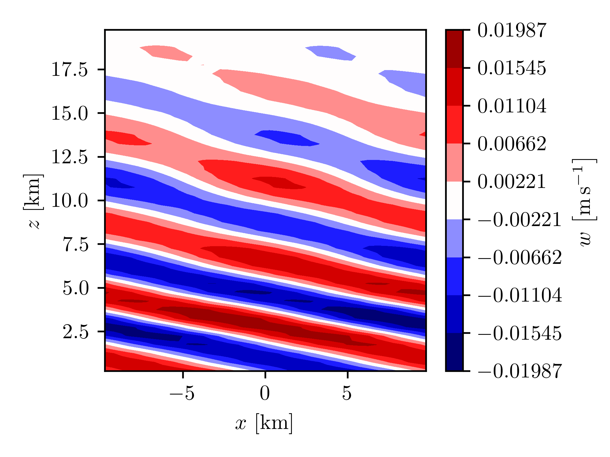
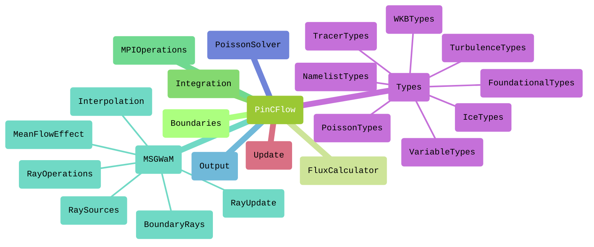
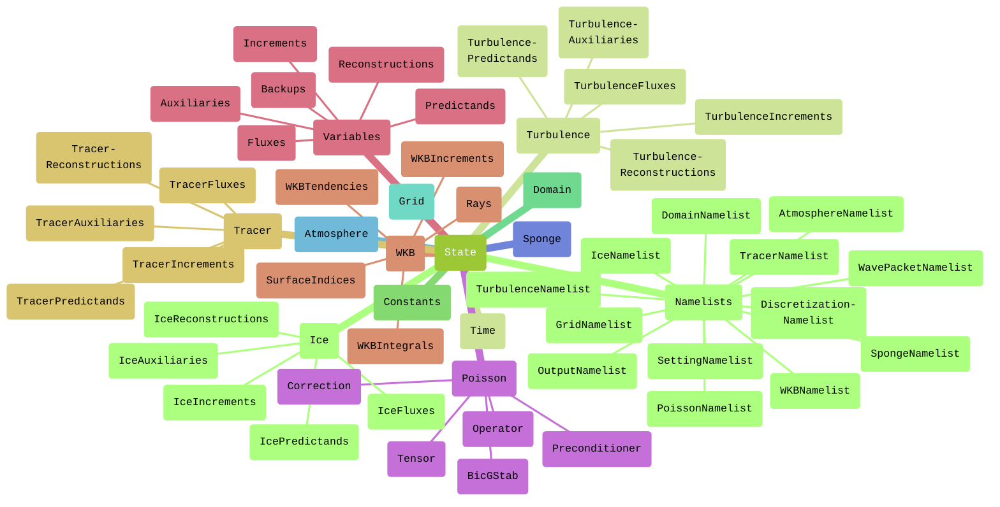

# PinCFlow.jl

## Introduction

PinCFlow integrates the pseudo-incompressible equations in a conservative flux form ([Klein, 2009](https://doi.org/10.1007/s00162-009-0104-y); [Rieper et al., 2013](https://doi.org/10.1175/mwr-d-12-00026.1)), using a a semi-implicit method that combines explicit and implicit time-stepping schemes ([Benacchio & Klein, 2019](https://doi.org/10.1175/MWR-D-19-0073.1); [Schmid et al., 2021](https://doi.org/10.1175/MWR-D-21-0126.1)). The equations are discretized with a finite-volume method, such that all quantities are represented by spatial averages over grid cells and fluxes are computed on the respective cell interfaces. The grid is staggered so that the velocity components are defined at the same points as the corresponding fluxes of scalar quantities. PinCFlow operates in a vertically stretched terrain-following coordinate system based on [Gal-Chen and Somerville (1975a)](https://doi.org/10.1016/0021-9991(75)90037-6), [Gal-Chen and Somerville (1975b)](https://doi.org/10.1016/0021-9991(75)90054-6) and [Clark (1977)](https://doi.org/10.1016/0021-9991(77)90057-2).

The Lagrangian WKB model MSGWaM is interactively coupled to PinCFlow, so that unresolved gravity waves may be parameterized in a manner that accounts for transience and horizontal propagation. The resolved fields are updated with tendencies computed by MSGWaM at the beginning of every time step. A description of PinCFlow-MSGWaM can be found in [Wilhelm et al. (2018)](https://doi.org/10.1175/JAS-D-17-0289.1), [Wei et al. (2019)](https://doi.org/10.1175/JAS-D-18-0337.1) and [Jochum et al. (2025)](https://doi.org/10.1175/JAS-D-24-0158.1).

## User guide

### Installation

To install PinCFlow, first make sure you have installed [Julia](https://docs.julialang.org/en/v1/manual/installation/). You can then clone this repository with

```shell
git clone git@gitlab.dkrz.de:atmodynamics-goethe-universitaet-frankfurt/pinc.git
```

and set up the project environment by running

```shell
julia --project -e 'using Pkg; Pkg.instantiate()'
```

in the root directory of your clone.

### Running the model

As a minimal example, the script

```julia
using PinCFlow

integrate(Namelists())
```

runs PinCFlow in its default configuration, if executed with

```shell
julia --project --check-bounds=no --math-mode=fast script.jl
```

in the root directory of the repository. This simulation will finish comparatively quickly and won't produce particularly interesting results, since PinCFlow simply initializes a $1 \times 1 \times 1 \, \mathrm{km^3}$ isothermal atmosphere at rest with $3 \times 3 \times 3$ grid points and integrates the governing equations over one hour. A more complex configuration can be set up by providing namelists with changed parameters. For instance, running the script

```julia
# examples/submit/periodic_hill.jl

using PinCFlow

atmosphere = AtmosphereNamelist(; backgroundflow_dim = (1.0E+1, 0.0E+0, 0.0E+0))
domain = DomainNamelist(;
    sizex = 40,
    sizey = 1,
    sizez = 40,
    lx_dim = (-1.0E+4, 1.0E+4),
    ly_dim = (-1.0E+4, 1.0E+4),
    lz_dim = (0.0E+0, 2.0E+4),
)
grid = GridNamelist(; mountainheight_dim = 1.0E+1, mountainwidth_dim = 1.0E+4)
output = OutputNamelist(;
    output_variables = (:w,),
    output_file = ARGS[1] * "/pincflow_output.h5",
)
sponge = SpongeNamelist(; spongelayer = true)

integrate(Namelists(; atmosphere, domain, grid, output, sponge))

```

yields a 2D simulation with an initial wind of $10 \, \mathrm{m \, s^{- 1}}$ that generates a mountain wave above a periodic hill. The vertical wind is written to the output file `pincflow_output.h5` in the directory specified by an additional argument to the script. More involved examples are given in the "Examples" section of the documentation. A description of all namelists and their parameters is provided in the "Reference" section.

If you want to run PinCFlow in parallel, make sure you are using the correct backends for [MPI.jl](https://juliaparallel.org/MPI.jl/latest/) and [HDF5.jl](https://juliaio.github.io/HDF5.jl/stable/). By default, the two packages use JLL backends that have been automatically installed. If you want to keep this setting, you only need to make sure to use the correct MPI binary (specifically not that of a default MPI installation on your system). You can do so by running

```shell
mpiexec=$(julia --project -e 'using MPICH_jll; println(MPICH_jll.mpiexec_path)')
${mpiexec} -n ${tasks} julia --project --check-bounds=no --math-mode=fast script.jl
```

with `tasks` set to the number of MPI processes. Note that in `script.jl`, the parameters `npx`, `npy` and `npz` of the namelist `domain`, which represent the number of MPI processes in the three dimensions of physical space, need to be set such that their product is equal to `tasks`.

However, if you plan to run PinCFlow on a cluster, you may want to consider using a provided MPI installation as backend. In that case, the MPI preferences need to be updated accordingly and the HDF5 backend has to be set to a library that has been installed with parallel support, using the chosen MPI installation. This can be done by running

```shell
julia --project -e 'using MPIPreferences; MPIPreferences.use_system_binary(; library_names = ["/path/to/mpi/library/"])'
julia --project -e 'using HDF5; HDF5.API.set_libraries!("/path/to/libhdf5.so", "/path/to/libhdf5_hl.so")'
```

with the paths set appropriately (more details can be found in the documentations of MPI.jl and HDF5.jl). Note that this configuration will be saved in `LocalPreferences.toml`, so that the new backends will be used by all future scripts run in the project. By running

```shell
julia --project -e 'using MPIPreferences; MPIPreferences.use_system_binary()'
julia --project -e 'using HDF5; HDF5.API.set_libraries!()'
```

you can restore the default backends. Having configured MPI.jl and HDF5.jl to use installations on your system, you can run

```shell
mpiexec -n ${tasks} julia --project --check-bounds=no --math-mode=fast script.jl
```

with `mpiexec` being your chosen system binary.

### Visualizing the results

PinCFlow uses parallel HDF5 to write simulation data. By default, the path to the output file is `pincflow_output.h5` (from the directory in which the run script is executed). This may be changed by setting the parameter `output_file` of the namelist `output` accordingly. The dimensions of most output fields are (in order) $\widehat{x}$ (zonal axis), $\widehat{y}$ (meridional axis), $\widehat{z}$ (axis orthogonal to the vertical coordinate surfaces) and $t$ (time). Ray-volume property fields differ slightly in that they have an additional (spectral) dimension in front and a vertical dimension that includes the first ghost layer below the surface. To specify which fields are to be written, set the parameters `output_variables`, `save_ray_volumes` and `prepare_restart` of the namelist `output` accordingly (more details are given in the "Reference" section of the documentation).

For the visualization of simulation results, we recommend using [PythonPlot.jl](https://github.com/JuliaPy/PythonPlot.jl). A style configuration and a function that facilitates the generation of symmetric contour plots are provided in `examples/visualization/style.jl`. The script

```julia
# examples/visualization/periodic_hill.jl

using HDF5
using LaTeXStrings

include("style.jl")

# Import the data.
data = h5open(ARGS[1] * "/pincflow_output.h5")

# Set the grid.
x = data["x"][:] ./ 1000
z = data["z"][:, 1, :] ./ 1000
x = x .* ones(size(z))

# Get the vertical wind.
w = data["w"][:, 1, :, end]

# Close the file.
close(data)

# Create the plot.
(levels, colormap) = symmetric_contours(minimum(w), maximum(w))
contours = contourf(x, z, w; levels = levels, cmap = colormap)
xlabel(L"x\,\left[\mathrm{km}\right]")
ylabel(L"z\,\left[\mathrm{km}\right]")
colorbar(contours; label = L"w\,\left[\mathrm{m\,s^{-1}}\right]")
savefig("examples/results/periodic_hill.png")
clf()

```

is an example for how to visualize the vertical wind at the end of a simple mountain-wave simulation performed with the script introduced [above](#Running-the-model). Once again, the directory which the output file has been saved to is given as an additional argument to the script. The resulting plot is displayed below.



## Developer guide

### Workflow

The code is shared in a GitLab repository. Any contributions to the code should adhere to the following workflow.

 1. If you are new to the project, create a remote development branch for your contributions (name it such that others can identify it as your branch) and clone the repository.

 1. Make your changes on your local development branch.

 1. Pull recent changes made on the remote master branch into your local master branch and merge it into your local development branch, resolving merge conflicts if necessary.

 1. **Ensure that the model is stable and that all canonical tests reproduce the sample results.**

 1. Push your changes to your remote development branch.

 1. Request to merge your remote development branch into the remote master branch.

### Writing code

Contributions to the code should respect the following rules.

  - Put every module, composite type (including constructor methods) and function into a file on its own, with the file name matching that of the object. Create a folder for every module (see below for a diagram of PinCFlow's modular structure).

  - Variables that are communicated between functions should be stored at an appropriate level of the `State` instance (see below for a diagram of PinCFlow's model-state structure).

  - Use type parameters to declare the types of all composite-type fields.

  - Declare the types of all method arguments and the return types of all methods that return something other than `nothing`.

  - Use `@views` in front of expressions that create slices.

  - Do not use Unicode.

  - Use `CamelCase` for the names of modules and types. Use single captial letters for type parameters. For all other objects, use `snake_case` (in case the name only contains (preferrably whole) words, e.g. `vertical_wind`) and `squashedcase` (in case the name is mathematical, e.g. `what` for $\widehat{w}$).





### Writing documentation

Contributions to the code should always be accompanied by corresponding contributions to the documentation, respecting the following rules.

  - Write a docstring for every module, function and type.

  - Module docstrings:

     1. Include the exact full signature within a Julia code block, followed by a single descriptive (pseudo-)sentence and (if needed) a second paragraph with more details.

     1. List links to imported modules in a `# See also` section, with one bullet for each.

  - Function docstrings:

     1. For every method, include the exact full signature within a Julia code block, followed by a single, descriptive sentence in imperative form and (if needed) a second paragraph with more details.

     1. List all positional and optional arguments with descriptions (but without types and default values) in an `# Arguments` section, with one bullet for each.

     1. List all keyword arguments with descriptions (but without types and default values) in a `# Keywords` section, with one bullet for each.

     1. List links to constructors/functions that are called in any of the explicitly defined constructor methods in a `# See also` section, with one bullet for each.

  - Type docstrings:

     1. Include the exact full signature within a Julia code block, followed by a single descriptive (pseudo-)sentence and (if needed) a second paragraph with more details.

     1. If the type is composite, include the exact full signature within a Julia code block, followed by a single, descriptive sentence in imperative form and (if needed) a second paragraph with more details, for each explicitly defined constructor method.

     1. If the type is composite, list all fields with their type restrictions and descriptions in a `# Fields` section, with one bullet for each.

     1. If the type is composite, list all positional and optional arguments of the explicitly defined constructor methods with descriptions (but without types and default values) in an `# Arguments` section, with one bullet for each.

     1. If the type is composite, list all keyword arguments of the explicitly defined constructor methods with descriptions (but without types and default values) in a `# Keywords` section, with one bullet for each.

     1. If the type is composite, list links to constructors/functions that are called in any of the explicitly defined constructor methods in a `# See also` section, with one bullet for each.

  - Use single backticks to identify code and double backticks to identify equations. Use LaTeX escape sequences instead of Unicode characters.

  - Place the starting and ending `"""` characters on lines by themselves.

### Markdown syntax

Markdown code should use the following syntax.

  - Headings:

    ```markdown
    # Heading level 1

    ## Heading level 2

    ### Heading level 3

    #### Heading level 4

    ##### Heading level 5

    ###### Heading level 6
    ```

  - Paragraphs:

    ```markdown
    This is the first paragraph.

    This is the second paragraph.
    ```

  - Emphasis:

    ```markdown
    This sentence contains *italic*, **bold** and ***italic bold*** words.
    ```

  - Block quotes:

    ```markdown
    This is a sentence above a block quote.

      > This is the first paragraph of a block quote.
      >
      >   > This is a nested block quote.
      >
      > This is the second paragraph of a block quote.

    This is a sentence below a block quote.

    ```

  - Unnumbered lists:

    ```markdown
    This is a sentence above an unnumbered list.

      - This is the first paragraph of the first item.

          - This is the first item of a nested list.

          - This is the second item of a nested list.

        This is the second paragraph of the first item.

      - This is the second item.

    This is a sentence below an unnumbered list.
    ```

  - Numbered lists:

    ```markdown
    This is a sentence above a numbered list.

     1. This is the first paragraph of the first item.

         1. This is the first item of a nested list.

         1. This is the second item of a nested list.

        This is the second paragraph of the first item.

     1. This is the second item.

     This is a sentence below a numbered list.
    ```

  - Inline code:

    ```markdown
    This sentence contains inline `code` and inline `` `nested code` ``.
    ```

  - Code blocks:

    `````````markdown
    This sentence contains the code block

    ```julia
    if true
        println("true")
    end
    ```

    and other stuff. This sentence contains the nested code blocks

    ``````markdown
    ```julia
    if true
        println("true")
    end
    ```
    ``````

    and other stuff.
    `````````

  - Horizontal rule:

    ```markdown
    ---
    ```

  - URLs and email addresses:

    ```markdown
    This sentence contains the URL <http://example.com> and the email address <fake@example.com>.
    ```

  - Links:

    ```markdown
    This sentence contains a [link](http://example.com).
    ```

  - Images:

    ```markdown
    
    ```

  - Backslash escapes:

    ```markdown
    This sentence contains the backslash escapes \\\`\*\_\{\}\[\]\(\)\#\+\-\.\!.
    ```

  - Inline math:

    ```markdown
    This sentence contains the equation $x^2 + y^2 = z^2$.
    ```

  - Centered math:

    ```markdown
    This sentence contains the equation

    $$x^2 + y^2 = z^2$$

    and other stuff.
    ```

In docstrings, the following syntax elements are different.

  - Inline math:

    ```markdown
    This sentence contains the equation ``x^2 + y^2 = z^2``.
    ```

  - Centered math:

    ``````markdown
    This sentence contains the equation

    ```math
    x^2 + y^2 = z^2
    ```

    and other stuff.
    ``````

Moreover, every backslash used for LaTeX commands in equations has to be doubled.

### Building and accessing the documentation

The code uses [Documenter.jl](https://documenter.juliadocs.org/stable/). To build the documentation, run

```shell
julia --project=docs -e 'using Pkg; Pkg.develop(; path = "."); Pkg.instantiate()'
julia --project=docs docs/make.jl
```

in the root directory of the repository. The documentation will be generated in the `docs/build` directory. To view it, open `docs/build/index.html` in a web browser or preview the file in Visual Studio Code with [Live Preview](https://marketplace.visualstudio.com/items?itemName=ms-vscode.live-server).

## List of publications

 1. Initial flow solver: [Rieper et al. (2013)](https://doi.org/10.1175/mwr-d-12-00026.1)

 1. Initial gravity-wave scheme: [Muraschko et al. (2014)](https://doi.org/10.1002/qj.2381)

 1. Gravity-wave breaking scheme: [Boeloeni et al. (2016)](https://doi.org/10.1175/JAS-D-16-0069.1)

 1. Gravity-wave theory: [Achatz et al. (2017)](https://doi.org/10.1002/qj.2926)

 1. Coupling of the flow solver and gravity-wave scheme: [Wilhelm et al. (2018)](https://doi.org/10.1175/JAS-D-17-0289.1)

 1. Horizontal propagation and direct approach in the gravity-wave scheme: [Wei et al. (2019)](https://doi.org/10.1175/JAS-D-18-0337.1)

 1. Semi-implicit time scheme: [Schmid et al. (2021)](https://doi.org/10.1175/MWR-D-21-0126.1)

 1. Extended gravity-wave theory: [Achatz et al. (2023)](https://doi.org/10.1063/5.0165180)

 1. Terrain-following coordinates & orographic source: [Jochum et al. (2025)](https://doi.org/10.1175/JAS-D-24-0158.1)
